# Fluxos do Backend — API + Agente de IA

> Diagramas em **Mermaid** (renderizam nativamente no GitHub/GitLab, no preview do VS Code e no Obsidian — nenhuma dependência precisa ser adicionada ao repo).
>
> Escopo: `apps/api` (NestJS) e `apps/ai-agent` (FastAPI). O front (`apps/web`) aparece apenas como origem das chamadas.
>
> Última verificação contra o código: 2026-07-27 (branch `feat/implements-password-recovery`).

## Índice

1. [Visão geral da arquitetura](#1-visão-geral-da-arquitetura)
2. [WhatsApp → Lançamento (fluxo principal)](#2-whatsapp--lançamento-fluxo-principal)
   - [2.1 Ingestão do webhook](#21-ingestão-do-webhook)
   - [2.2 Buffer / debounce](#22-buffer--debounce)
   - [2.3 Processamento da mensagem consolidada](#23-processamento-da-mensagem-consolidada)
   - [2.4 Classificação de intenção](#24-classificação-de-intenção-llm--regras)
   - [2.5 Regras de confirmação](#25-regras-de-confirmação)
   - [2.6 Criação do lançamento](#26-criação-do-lançamento)
   - [2.7 Áudio (STT)](#27-áudio-stt)
   - [2.8 Imagem / comprovante (visão)](#28-imagem--comprovante-visão)
   - [2.9 Máquina de estados da conversa](#29-máquina-de-estados-da-conversa)
   - [2.10 Idempotência e persistência](#210-idempotência-e-persistência)
   - [2.11 Sequência ponta a ponta](#211-sequência-ponta-a-ponta)
3. [Autenticação e conta](#3-autenticação-e-conta)
4. [Billing / assinaturas](#4-billing--assinaturas)
5. [Fluxos de dados financeiros](#5-fluxos-de-dados-financeiros-crud)
6. [Boas-vindas (API → Agente)](#6-boas-vindas-api--agente)
7. [Mapa de endpoints](#7-mapa-de-endpoints)
8. [Guards, segurança e observabilidade](#8-guards-segurança-e-observabilidade)
9. [Configuração relevante](#9-configuração-relevante)

---

## 1. Visão geral da arquitetura

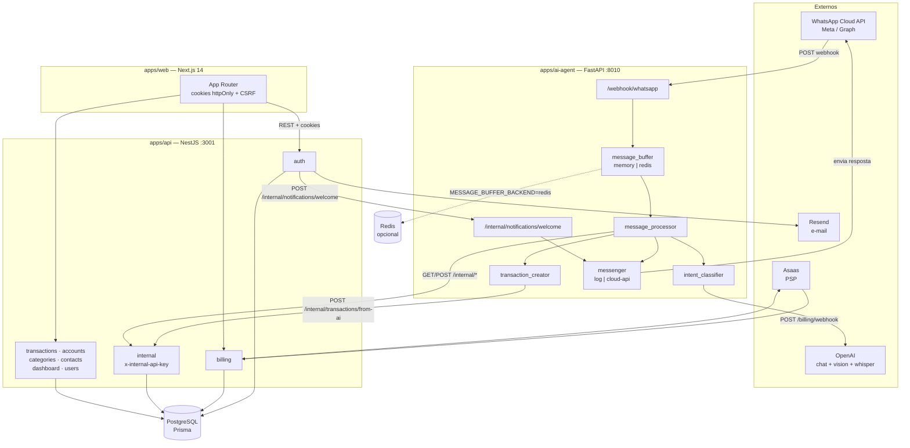
```mermaid
graph TB
    subgraph ext["Externos"]
        WA["WhatsApp Cloud API<br/>Meta / Graph"]
        OAI["OpenAI<br/>chat + vision + whisper"]
        ASA["Asaas<br/>PSP"]
        RES["Resend<br/>e-mail"]
    end

    subgraph web["apps/web — Next.js 14"]
        UI["App Router<br/>cookies httpOnly + CSRF"]
    end

    subgraph agent["apps/ai-agent — FastAPI :8010"]
        WH["/webhook/whatsapp"]
        BUF["message_buffer<br/>memory | redis"]
        MP["message_processor"]
        IC["intent_classifier"]
        TC["transaction_creator"]
        MSG["messenger<br/>log | cloud-api"]
        AINT["/internal/notifications/welcome"]
    end

    subgraph api["apps/api — NestJS :3001"]
        AUTH["auth"]
        BILL["billing"]
        INT["internal<br/>x-internal-api-key"]
        DOM["transactions · accounts<br/>categories · contacts<br/>dashboard · users"]
    end

    DB[("PostgreSQL<br/>Prisma")]
    RDS[("Redis<br/>opcional")]

    UI -->|"REST + cookies"| AUTH
    UI --> BILL
    UI --> DOM

    WA -->|"POST webhook"| WH
    WH --> BUF
    BUF --> MP
    MP --> IC
    IC --> OAI
    MP --> TC
    MP --> MSG
    MSG -->|"envia resposta"| WA
    BUF -.->|"MESSAGE_BUFFER_BACKEND=redis"| RDS

    TC -->|"POST /internal/transactions/from-ai"| INT
    MP -->|"GET/POST /internal/*"| INT
    AUTH -->|"POST /internal/notifications/welcome"| AINT
    AINT --> MSG

    ASA -->|"POST /billing/webhook"| BILL
    BILL --> ASA
    AUTH --> RES

    AUTH --> DB
    BILL --> DB
    INT --> DB
    DOM --> DB
```

**Contratos entre serviços**

| Direção | Autenticação | Uso |
| --- | --- | --- |
| Web → API | Cookies `access_token`/`refresh_token` (httpOnly) + `X-CSRF-Token` | Todo o produto |
| Agente → API | Header `x-internal-api-key` (`INTERNAL_API_KEY`) | Contato, categorias, contas, gate de assinatura, criação de lançamento, auditoria |
| API → Agente | Header `x-internal-api-key` (mesma chave) | Boas-vindas pós-cadastro |
| Meta → Agente | HMAC-SHA256 `X-Hub-Signature-256` (`WHATSAPP_WEBHOOK_SECRET`) | Webhook de mensagens |
| Asaas → API | `provider.verifyWebhook` sobre `req.rawBody` | Webhook de pagamentos |

---

## 2. WhatsApp → Lançamento (fluxo principal)

Este é o caminho crítico do produto. O desenho central é: **o webhook responde em milissegundos** (só valida assinatura e bufferiza), e todo o trabalho caro (LLM, STT, visão, chamadas à API) acontece **fora do request**.

### 2.1 Ingestão do webhook

`apps/ai-agent/src/routers/webhook.py`

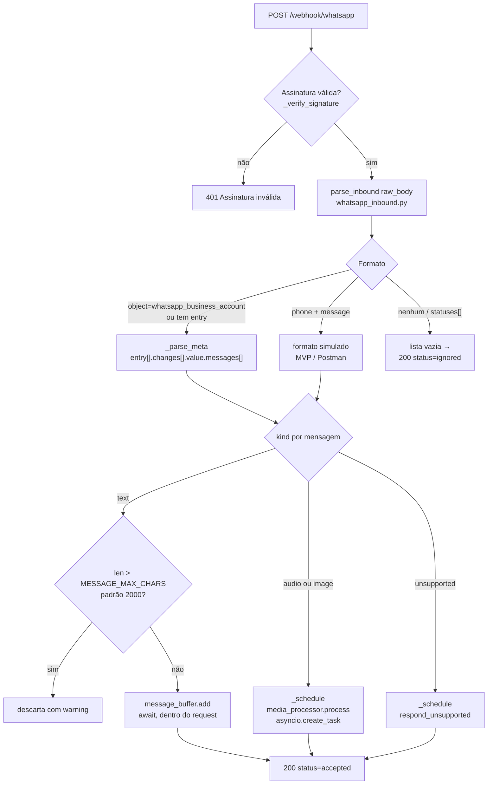
```mermaid
flowchart TD
    A["POST /webhook/whatsapp"] --> B{"Assinatura válida?<br/>_verify_signature"}
    B -->|"não"| B1["401 Assinatura inválida"]
    B -->|"sim"| C["parse_inbound raw_body<br/>whatsapp_inbound.py"]

    C --> D{"Formato"}
    D -->|"object=whatsapp_business_account<br/>ou tem entry"| E["_parse_meta<br/>entry[].changes[].value.messages[]"]
    D -->|"phone + message"| F["formato simulado<br/>MVP / Postman"]
    D -->|"nenhum / statuses[]"| G["lista vazia →<br/>200 status=ignored"]

    E --> H{"kind por mensagem"}
    F --> H

    H -->|"text"| I{"len > MESSAGE_MAX_CHARS<br/>padrão 2000?"}
    I -->|"sim"| I1["descarta com warning"]
    I -->|"não"| J["message_buffer.add<br/>await, dentro do request"]

    H -->|"audio ou image"| K["_schedule<br/>media_processor.process<br/>asyncio.create_task"]
    H -->|"unsupported"| L["_schedule<br/>respond_unsupported"]

    J --> M["200 status=accepted"]
    K --> M
    L --> M
```

Pontos de atenção:

- `GET /webhook/whatsapp` é o handshake da Meta: compara `hub.verify_token` com `WHATSAPP_VERIFY_TOKEN` em tempo constante e ecoa `hub.challenge`.
- Sem `WHATSAPP_WEBHOOK_SECRET`: **aceita** em desenvolvimento, **rejeita** em produção (`settings.is_production`).
- Eventos de status de entrega (`statuses[]`) retornam `200` sem processar — evita reenvio pela Meta.
- As tasks de mídia são guardadas em `_background_tasks` para não serem coletadas pelo GC, com callback que loga exceções.

### 2.2 Buffer / debounce

`apps/ai-agent/src/services/message_buffer.py` · `redis_buffer.py`

O WhatsApp fragmenta instruções ("gastei" / "47,50" / "no mercado"). O buffer consolida por telefone.

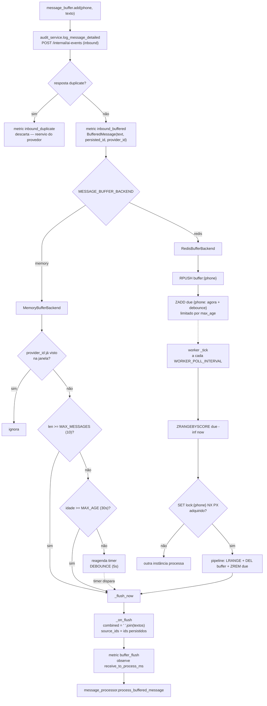
```mermaid
flowchart TD
    A["message_buffer.add(phone, texto)"] --> B["audit_service.log_message_detailed<br/>POST /internal/ai-events (inbound)"]
    B --> C{"resposta duplicate?"}
    C -->|"sim"| C1["metric inbound_duplicate<br/>descarta — reenvio do provedor"]
    C -->|"não"| D["metric inbound_buffered<br/>BufferedMessage(text, persisted_id, provider_id)"]
    D --> E{"MESSAGE_BUFFER_BACKEND"}

    E -->|"memory"| F["MemoryBufferBackend"]
    E -->|"redis"| G["RedisBufferBackend"]

    F --> F1{"provider_id já visto<br/>na janela?"}
    F1 -->|"sim"| F2["ignora"]
    F1 -->|"não"| F3{"len >= MAX_MESSAGES (10)?"}
    F3 -->|"sim"| FLUSH["_flush_now"]
    F3 -->|"não"| F4{"idade >= MAX_AGE (30s)?"}
    F4 -->|"sim"| FLUSH
    F4 -->|"não"| F5["reagenda timer<br/>DEBOUNCE (5s)"]
    F5 -.->|"timer dispara"| FLUSH

    G --> G1["RPUSH buffer:{phone}"]
    G1 --> G2["ZADD due {phone: agora + debounce}<br/>limitado por max_age"]
    G2 -.-> W["worker _tick<br/>a cada WORKER_POLL_INTERVAL"]
    W --> W1["ZRANGEBYSCORE due -inf now"]
    W1 --> W2{"SET lock:{phone} NX PX<br/>adquirido?"}
    W2 -->|"não"| W3["outra instância processa"]
    W2 -->|"sim"| W4["pipeline: LRANGE + DEL buffer + ZREM due"]
    W4 --> FLUSH

    FLUSH --> H["_on_flush<br/>combined = ' '.join(textos)<br/>source_ids = ids persistidos"]
    H --> I["metric buffer_flush<br/>observe receive_to_process_ms"]
    I --> J["message_processor.process_buffered_message"]
```

Diferenças entre backends:

| | `memory` (padrão) | `redis` |
| --- | --- | --- |
| Durabilidade | perde no restart | sobrevive ao restart |
| Múltiplas instâncias | não | sim (lock `SET NX PX`) |
| Retry | não | `MESSAGE_BUFFER_MAX_RETRIES` com backoff exponencial |
| Dead letter | não | lista `dlq` no Redis + metric `dlq` |
| Serialização por telefone | `asyncio.Lock` | lock distribuído `lock:{phone}` |

### 2.3 Processamento da mensagem consolidada

`apps/ai-agent/src/services/message_processor.py`

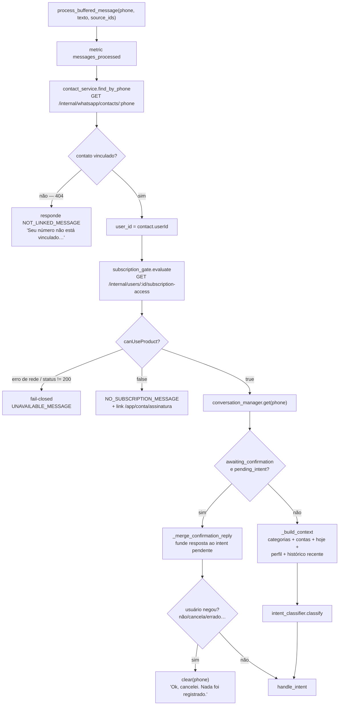
```mermaid
flowchart TD
    A["process_buffered_message(phone, texto, source_ids)"] --> B["metric messages_processed"]
    B --> C["contact_service.find_by_phone<br/>GET /internal/whatsapp/contacts/:phone"]
    C --> D{"contato vinculado?"}
    D -->|"não — 404"| D1["responde NOT_LINKED_MESSAGE<br/>'Seu número não está vinculado…'"]
    D -->|"sim"| E["user_id = contact.userId"]

    E --> F["subscription_gate.evaluate<br/>GET /internal/users/:id/subscription-access"]
    F --> G{"canUseProduct?"}
    G -->|"erro de rede / status != 200"| G1["fail-closed<br/>UNAVAILABLE_MESSAGE"]
    G -->|"false"| G2["NO_SUBSCRIPTION_MESSAGE<br/>+ link /app/conta/assinatura"]
    G -->|"true"| H["conversation_manager.get(phone)"]

    H --> I{"awaiting_confirmation<br/>e pending_intent?"}
    I -->|"sim"| J["_merge_confirmation_reply<br/>funde resposta ao intent pendente"]
    J --> J1{"usuário negou?<br/>não/cancela/errado…"}
    J1 -->|"sim"| J2["clear(phone)<br/>'Ok, cancelei. Nada foi registrado.'"]
    J1 -->|"não"| K["handle_intent"]

    I -->|"não"| L["_build_context<br/>categorias + contas + hoje +<br/>perfil + histórico recente"]
    L --> M["intent_classifier.classify"]
    M --> K
```

O **gate de assinatura vem antes de qualquer operação paga** (LLM, STT, visão) — é fail-closed por design: instabilidade de rede bloqueia em vez de gerar custo.

`_build_context` monta o payload que vai ao LLM:

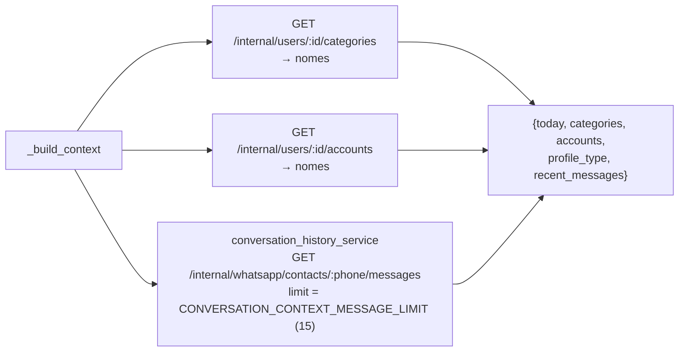
```mermaid
flowchart LR
    A["_build_context"] --> B["GET /internal/users/:id/categories<br/>→ nomes"]
    A --> C["GET /internal/users/:id/accounts<br/>→ nomes"]
    A --> D["conversation_history_service<br/>GET /internal/whatsapp/contacts/:phone/messages<br/>limit = CONVERSATION_CONTEXT_MESSAGE_LIMIT (15)"]
    B & C & D --> E["{today, categories, accounts,<br/>profile_type, recent_messages}"]
```

Falha ao carregar categorias/contas ou histórico **não interrompe** o fluxo: loga warning e segue com listas vazias.

### 2.3.1 `handle_intent` — roteamento por intenção

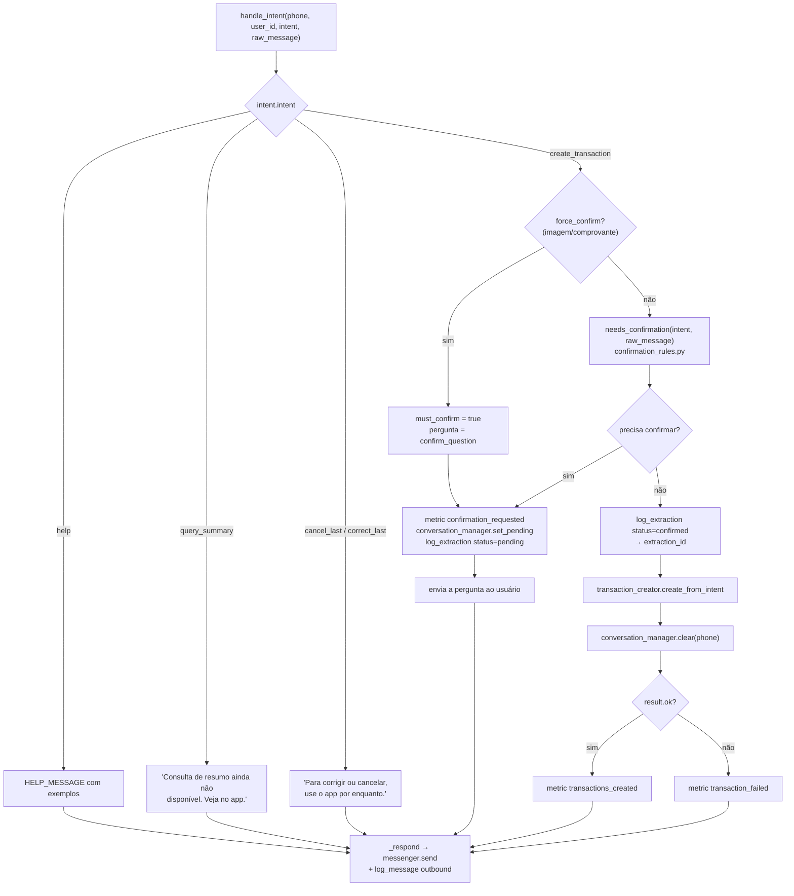
```mermaid
flowchart TD
    A["handle_intent(phone, user_id, intent, raw_message)"] --> B{"intent.intent"}

    B -->|"help"| B1["HELP_MESSAGE com exemplos"]
    B -->|"query_summary"| B2["'Consulta de resumo ainda não<br/>disponível. Veja no app.'"]
    B -->|"cancel_last / correct_last"| B3["'Para corrigir ou cancelar,<br/>use o app por enquanto.'"]
    B -->|"create_transaction"| C{"force_confirm?<br/>(imagem/comprovante)"}

    C -->|"sim"| D["must_confirm = true<br/>pergunta = confirm_question"]
    C -->|"não"| E["needs_confirmation(intent, raw_message)<br/>confirmation_rules.py"]
    E --> F{"precisa confirmar?"}
    D --> G
    F -->|"sim"| G["metric confirmation_requested<br/>conversation_manager.set_pending<br/>log_extraction status=pending"]
    G --> G1["envia a pergunta ao usuário"]

    F -->|"não"| H["log_extraction status=confirmed<br/>→ extraction_id"]
    H --> I["transaction_creator.create_from_intent"]
    I --> J["conversation_manager.clear(phone)"]
    J --> K{"result.ok?"}
    K -->|"sim"| K1["metric transactions_created"]
    K -->|"não"| K2["metric transaction_failed"]
    K1 & K2 --> L["_respond → messenger.send<br/>+ log_message outbound"]
    B1 & B2 & B3 & G1 --> L
```

### 2.4 Classificação de intenção (LLM + regras)

`apps/ai-agent/src/services/intent_classifier.py`

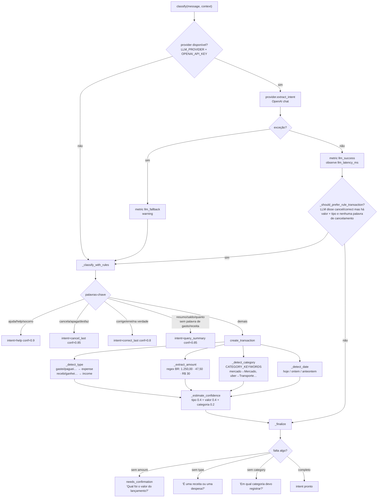
```mermaid
flowchart TD
    A["classify(message, context)"] --> B{"provider disponível?<br/>LLM_PROVIDER + OPENAI_API_KEY"}
    B -->|"não"| R["_classify_with_rules"]
    B -->|"sim"| C["provider.extract_intent<br/>OpenAI chat"]
    C --> D{"exceção?"}
    D -->|"sim"| D1["metric llm_fallback<br/>warning"] --> R
    D -->|"não"| E["metric llm_success<br/>observe llm_latency_ms"]
    E --> F{"_should_prefer_rule_transaction?<br/>LLM disse cancel/correct mas há<br/>valor + tipo e nenhuma palavra<br/>de cancelamento"}
    F -->|"sim"| R
    F -->|"não"| G["_finalize"]

    R --> R1{"palavras-chave"}
    R1 -->|"ajuda/help/socorro"| RH["intent=help conf=0.9"]
    R1 -->|"cancela/apaga/desfaz"| RC["intent=cancel_last conf=0.85"]
    R1 -->|"corrige/errei/na verdade"| RR["intent=correct_last conf=0.8"]
    R1 -->|"resumo/saldo/quanto<br/>sem palavra de gasto/receita"| RQ["intent=query_summary conf=0.85"]
    R1 -->|"demais"| RT["create_transaction"]

    RT --> S1["_detect_type<br/>gastei/paguei… → expense<br/>recebi/ganhei… → income"]
    RT --> S2["_extract_amount<br/>regex BR: 1.250,00 · 47,50 · R$ 30"]
    RT --> S3["_detect_category<br/>CATEGORY_KEYWORDS<br/>mercado→Mercado, uber→Transporte…"]
    RT --> S4["_detect_date<br/>hoje / ontem / anteontem"]
    S1 & S2 & S3 & S4 --> T["_estimate_confidence<br/>tipo 0.4 + valor 0.4 + categoria 0.2"]
    T --> G

    G --> G1{"falta algo?"}
    G1 -->|"sem amount"| GA["needs_confirmation<br/>'Qual foi o valor do lançamento?'"]
    G1 -->|"sem type"| GB["'É uma receita ou uma despesa?'"]
    G1 -->|"sem category"| GC["'Em qual categoria devo registrar?'"]
    G1 -->|"completo"| GD["intent pronto"]
```

O fallback por regras garante que o produto continua funcionando **sem `OPENAI_API_KEY`** — apenas com menor precisão.

### 2.5 Regras de confirmação

`apps/ai-agent/src/services/confirmation_rules.py` — avaliadas **em ordem**, a primeira que casa vence:

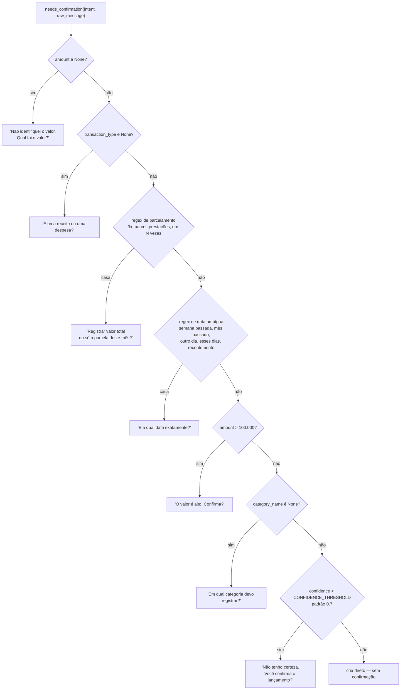
```mermaid
flowchart TD
    A["needs_confirmation(intent, raw_message)"] --> B{"amount é None?"}
    B -->|"sim"| B1["'Não identifiquei o valor.<br/>Qual foi o valor?'"]
    B -->|"não"| C{"transaction_type é None?"}
    C -->|"sim"| C1["'É uma receita ou uma despesa?'"]
    C -->|"não"| D{"regex de parcelamento<br/>3x, parcel, prestações, em N vezes"}
    D -->|"casa"| D1["'Registrar valor total<br/>ou só a parcela deste mês?'"]
    D -->|"não"| E{"regex de data ambígua<br/>semana passada, mês passado,<br/>outro dia, esses dias, recentemente"}
    E -->|"casa"| E1["'Em qual data exatamente?'"]
    E -->|"não"| F{"amount > 100.000?"}
    F -->|"sim"| F1["'O valor é alto. Confirma?'"]
    F -->|"não"| G{"category_name é None?"}
    G -->|"sim"| G1["'Em qual categoria devo registrar?'"]
    G -->|"não"| H{"confidence < CONFIDENCE_THRESHOLD<br/>padrão 0.7"}
    H -->|"sim"| H1["'Não tenho certeza.<br/>Você confirma o lançamento?'"]
    H -->|"não"| I["cria direto — sem confirmação"]
```

Quando o usuário responde à pergunta, `_merge_confirmation_reply` funde a resposta ao intent pendente:

- palavras negativas (`não`, `cancela`, `errado`, `deixa`) → cancela e limpa o estado;
- reclassifica a resposta por regras e preenche `amount` / `transaction_type` / `category_name` / `transaction_date` faltantes;
- se a categoria não veio por regras, `_match_category_reply` compara a resposta (normalizada, sem acentos) com as categorias reais do usuário — igualdade primeiro, depois substring;
- eleva `confidence` para pelo menos `CONFIDENCE_THRESHOLD` e zera `needs_confirmation`, para o intent passar direto na próxima avaliação.

### 2.6 Criação do lançamento

`apps/ai-agent/src/services/transaction_creator.py` → `apps/api/src/internal/internal.service.ts`

```mermaid
sequenceDiagram
    autonumber
    participant TC as transaction_creator
    participant API as API /internal
    participant DB as PostgreSQL

    TC->>API: GET /internal/users/{id}/accounts
    API->>DB: account.findMany(userId, isActive) order createdAt asc
    API-->>TC: contas
    Note over TC: _resolve_account — casa por nome<br/>normalizado; senão a mais antiga.<br/>Sem contas → "Crie uma conta no app"

    opt intent.category_name
        TC->>API: GET /internal/users/{id}/categories
        API-->>TC: categorias
        Note over TC: _resolve_category — igualdade exata,<br/>depois substring; senão null
    end

    TC->>API: POST /internal/transactions/from-ai<br/>{userId, accountId, categoryId, type, amount,<br/>description, transactionDate, status=confirmed,<br/>source=ai, rawInput, aiExtractedTransactionId}
    API->>API: assertCanUseProduct(userId)
    API->>DB: valida account.userId === userId
    API->>DB: valida category do usuário ou padrão
    API->>DB: transaction.create(source=ai)
    alt status === confirmed
        API->>DB: accountsService.recalculateBalance(accountId)
    end
    opt aiExtractedTransactionId
        API->>DB: aiExtractedTransaction.update<br/>{transactionId, status: confirmed}
    end
    API-->>TC: transaction

    alt 200/201
        TC-->>TC: "Lançamento criado! Despesa de R$ 47,50<br/>em Mercado em 27/07/2026."
    else erro de rede
        TC-->>TC: "Não consegui registrar agora.<br/>Tente novamente em instantes."
    else status != 2xx
        TC-->>TC: "Não consegui registrar o lançamento.<br/>Verifique os dados e tente de novo."
    end
```

Rastreabilidade: a `AiExtractedTransaction` é criada **antes** do lançamento (status `confirmed`) e recebe o `transactionId` depois — é o que alimenta `GET /transactions/:id/ai-audit`.

### 2.7 Áudio (STT)

`media_processor._process_audio`

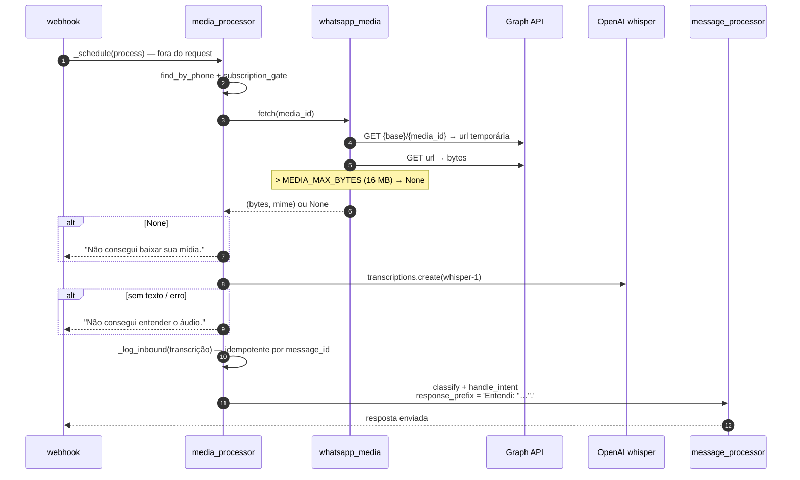
```mermaid
sequenceDiagram
    autonumber
    participant WH as webhook
    participant MPR as media_processor
    participant WM as whatsapp_media
    participant META as Graph API
    participant STT as OpenAI whisper
    participant MP as message_processor

    WH->>MPR: _schedule(process) — fora do request
    MPR->>MPR: find_by_phone + subscription_gate
    MPR->>WM: fetch(media_id)
    WM->>META: GET {base}/{media_id} → url temporária
    WM->>META: GET url → bytes
    Note over WM: > MEDIA_MAX_BYTES (16 MB) → None
    WM-->>MPR: (bytes, mime) ou None
    alt None
        MPR-->>WH: "Não consegui baixar sua mídia."
    end
    MPR->>STT: transcriptions.create(whisper-1)
    alt sem texto / erro
        MPR-->>WH: "Não consegui entender o áudio."
    end
    MPR->>MPR: _log_inbound(transcrição) — idempotente por message_id
    MPR->>MP: classify + handle_intent<br/>response_prefix = 'Entendi: "…".'
    MP-->>WH: resposta enviada
```

O áudio segue exatamente as mesmas regras de confirmação do texto — a transcrição vira a `raw_message`.

### 2.8 Imagem / comprovante (visão)

`media_processor._process_image`

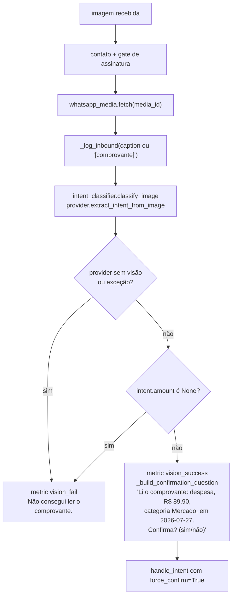
```mermaid
flowchart TD
    A["imagem recebida"] --> B["contato + gate de assinatura"]
    B --> C["whatsapp_media.fetch(media_id)"]
    C --> D["_log_inbound(caption ou '[comprovante]')"]
    D --> E["intent_classifier.classify_image<br/>provider.extract_intent_from_image"]
    E --> F{"provider sem visão<br/>ou exceção?"}
    F -->|"sim"| F1["metric vision_fail<br/>'Não consegui ler o comprovante.'"]
    F -->|"não"| G{"intent.amount é None?"}
    G -->|"sim"| F1
    G -->|"não"| H["metric vision_success<br/>_build_confirmation_question<br/>'Li o comprovante: despesa, R$ 89,90,<br/>categoria Mercado, em 2026-07-27.<br/>Confirma? (sim/não)'"]
    H --> I["handle_intent com force_confirm=True"]
```

**Comprovante sempre pede confirmação**, independentemente da confiança — decisão deliberada, já que a extração por visão é a mais sujeita a erro.

### 2.9 Máquina de estados da conversa

`conversation_manager.py` — em memória, TTL de `CONVERSATION_TTL_MINUTES` (30 min), por telefone.

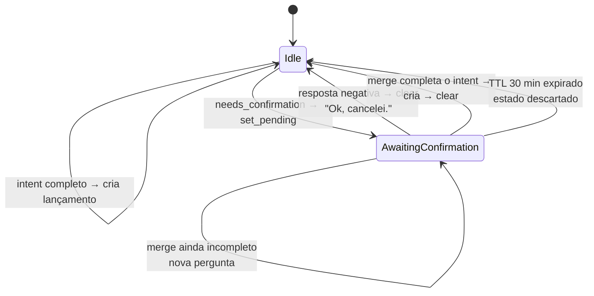
```mermaid
stateDiagram-v2
    [*] --> Idle
    Idle --> Idle: intent completo → cria lançamento
    Idle --> AwaitingConfirmation: needs_confirmation → set_pending
    AwaitingConfirmation --> Idle: resposta negativa → clear<br/>"Ok, cancelei."
    AwaitingConfirmation --> Idle: merge completa o intent → cria → clear
    AwaitingConfirmation --> AwaitingConfirmation: merge ainda incompleto<br/>nova pergunta
    AwaitingConfirmation --> Idle: TTL 30 min expirado<br/>estado descartado
```

> Limitação conhecida (MVP): o estado é **por processo**. Com o backend Redis e múltiplas instâncias, uma confirmação pode cair em uma instância que não tem o `pending_intent` — nesse caso a mensagem é reclassificada do zero.

### 2.10 Idempotência e persistência

Tudo que entra e sai é persistido via `POST /internal/ai-events` (`audit_service`).

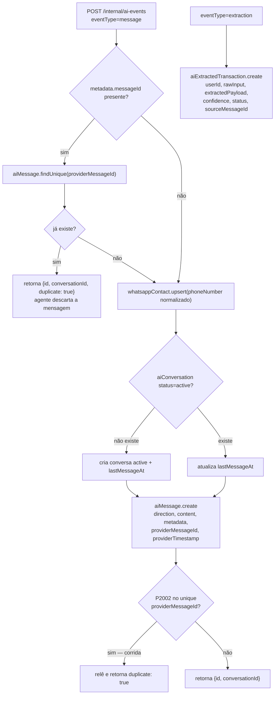
```mermaid
flowchart TD
    A["POST /internal/ai-events<br/>eventType=message"] --> B{"metadata.messageId presente?"}
    B -->|"sim"| C["aiMessage.findUnique(providerMessageId)"]
    C --> D{"já existe?"}
    D -->|"sim"| D1["retorna {id, conversationId, duplicate: true}<br/>agente descarta a mensagem"]
    D -->|"não"| E
    B -->|"não"| E["whatsappContact.upsert(phoneNumber normalizado)"]
    E --> F{"aiConversation status=active?"}
    F -->|"não existe"| F1["cria conversa active + lastMessageAt"]
    F -->|"existe"| F2["atualiza lastMessageAt"]
    F1 & F2 --> G["aiMessage.create<br/>direction, content, metadata,<br/>providerMessageId, providerTimestamp"]
    G --> H{"P2002 no unique<br/>providerMessageId?"}
    H -->|"sim — corrida"| H1["relê e retorna duplicate: true"]
    H -->|"não"| H2["retorna {id, conversationId}"]

    I["eventType=extraction"] --> J["aiExtractedTransaction.create<br/>userId, rawInput, extractedPayload,<br/>confidence, status, sourceMessageId"]
```

Três camadas de deduplicação:

1. **Banco** — `providerMessageId` `@unique` em `AiMessage`; sobrevive a restart e vale para sempre.
2. **Buffer em memória** — `seen_provider_ids` por telefone, dentro da janela de debounce.
3. **Corrida** — captura de `P2002` no `create`, relê e devolve `duplicate: true`.

Modelos Prisma envolvidos: `WhatsappContact` → `AiConversation` → `AiMessage` → `AiExtractedTransaction` → `Transaction`.

### 2.11 Sequência ponta a ponta

Caso feliz, mensagem de texto que exige uma confirmação:

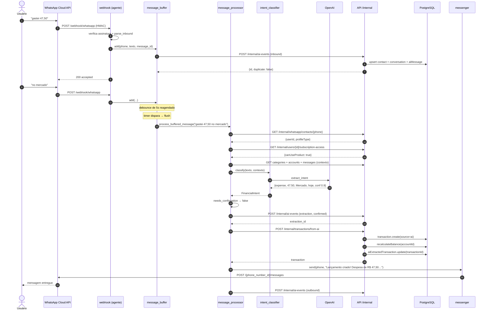
```mermaid
sequenceDiagram
    autonumber
    actor U as Usuário
    participant META as WhatsApp Cloud API
    participant WH as webhook (agente)
    participant BUF as message_buffer
    participant MP as message_processor
    participant IC as intent_classifier
    participant LLM as OpenAI
    participant API as API /internal
    participant DB as PostgreSQL
    participant MSG as messenger

    U->>META: "gastei 47,50"
    META->>WH: POST /webhook/whatsapp (HMAC)
    WH->>WH: verifica assinatura + parse_inbound
    WH->>BUF: add(phone, texto, message_id)
    BUF->>API: POST /internal/ai-events (inbound)
    API->>DB: upsert contact + conversation + aiMessage
    API-->>BUF: {id, duplicate: false}
    WH-->>META: 200 accepted

    U->>META: "no mercado"
    META->>WH: POST /webhook/whatsapp
    WH->>BUF: add(...)
    Note over BUF: debounce de 5s reagendado

    Note over BUF: timer dispara → flush
    BUF->>MP: process_buffered_message("gastei 47,50 no mercado")
    MP->>API: GET /internal/whatsapp/contacts/{phone}
    API-->>MP: {userId, profileType}
    MP->>API: GET /internal/users/{id}/subscription-access
    API-->>MP: {canUseProduct: true}
    MP->>API: GET categories + accounts + messages (contexto)
    MP->>IC: classify(texto, contexto)
    IC->>LLM: extract_intent
    LLM-->>IC: {expense, 47.50, Mercado, hoje, conf 0.9}
    IC-->>MP: FinancialIntent

    MP->>MP: needs_confirmation → false
    MP->>API: POST /internal/ai-events (extraction, confirmed)
    API-->>MP: extraction_id
    MP->>API: POST /internal/transactions/from-ai
    API->>DB: transaction.create(source=ai)
    API->>DB: recalculateBalance(accountId)
    API->>DB: aiExtractedTransaction.update(transactionId)
    API-->>MP: transaction
    MP->>MSG: send(phone, "Lançamento criado! Despesa de R$ 47,50…")
    MSG->>META: POST /{phone_number_id}/messages
    META-->>U: mensagem entregue
    MP->>API: POST /internal/ai-events (outbound)
```

**Tratamento de falhas ao longo do caminho**

| Ponto | Falha | Comportamento |
| --- | --- | --- |
| Webhook | assinatura inválida | `401`, nada é processado |
| Webhook | payload sem mensagem | `200 ignored` (evita reenvio da Meta) |
| Buffer | flush lança exceção (memory) | loga, não derruba o worker |
| Buffer | flush lança exceção (redis) | retry com backoff → `dlq` |
| Contato | 404 / rede | responde "não vinculado" |
| Assinatura | rede ou status != 200 | **fail-closed** — bloqueia e avisa instabilidade |
| Contexto | categorias/contas/histórico indisponíveis | segue com listas vazias |
| LLM | exceção | fallback de regras (`llm_fallback`) |
| STT / visão | exceção ou vazio | mensagem de fallback amigável |
| Mídia | sem token, rede, > 16 MB | "Não consegui baixar sua mídia" |
| Criação | rede / status != 2xx | mensagem de erro, `transaction_failed` |
| Auditoria | qualquer falha | apenas loga — **nunca** derruba o fluxo |
| Envio | Cloud API recusa | loga status/corpo, sem propagar |

---

## 3. Autenticação e conta

`apps/api/src/auth/`

### 3.1 Cadastro

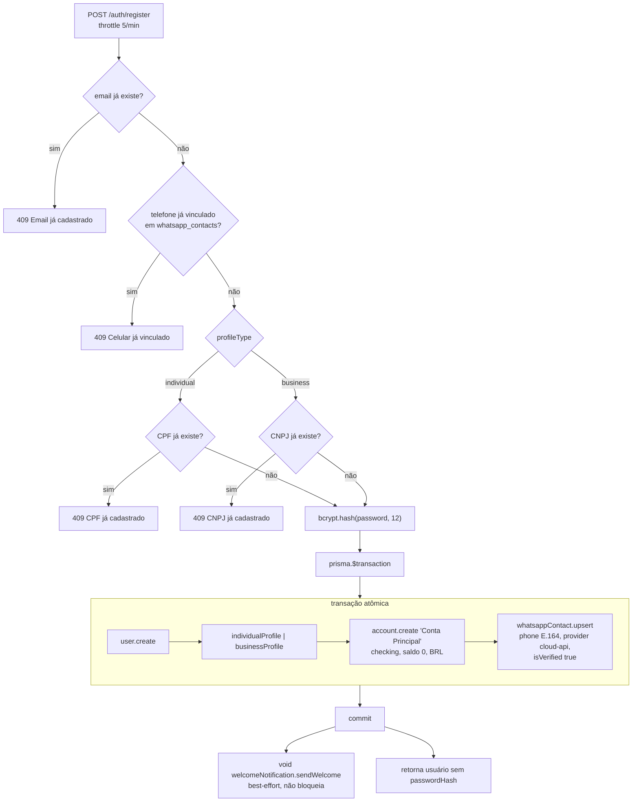
```mermaid
flowchart TD
    A["POST /auth/register<br/>throttle 5/min"] --> B{"email já existe?"}
    B -->|"sim"| B1["409 Email já cadastrado"]
    B -->|"não"| C{"telefone já vinculado<br/>em whatsapp_contacts?"}
    C -->|"sim"| C1["409 Celular já vinculado"]
    C -->|"não"| D{"profileType"}
    D -->|"individual"| D1{"CPF já existe?"}
    D -->|"business"| D2{"CNPJ já existe?"}
    D1 -->|"sim"| DX["409 CPF já cadastrado"]
    D2 -->|"sim"| DY["409 CNPJ já cadastrado"]
    D1 -->|"não"| E["bcrypt.hash(password, 12)"]
    D2 -->|"não"| E
    E --> F["prisma.$transaction"]

    subgraph tx["transação atômica"]
        F1["user.create"] --> F2["individualProfile | businessProfile"]
        F2 --> F3["account.create 'Conta Principal'<br/>checking, saldo 0, BRL"]
        F3 --> F4["whatsappContact.upsert<br/>phone E.164, provider cloud-api,<br/>isVerified true"]
    end

    F --> tx
    tx --> G["commit"]
    G --> H["void welcomeNotification.sendWelcome<br/>best-effort, não bloqueia"]
    G --> I["retorna usuário sem passwordHash"]
```

O cadastro já **vincula o WhatsApp** — é isso que faz `find_by_phone` resolver no primeiro uso do canal.

### 3.2 Login, refresh e sessão

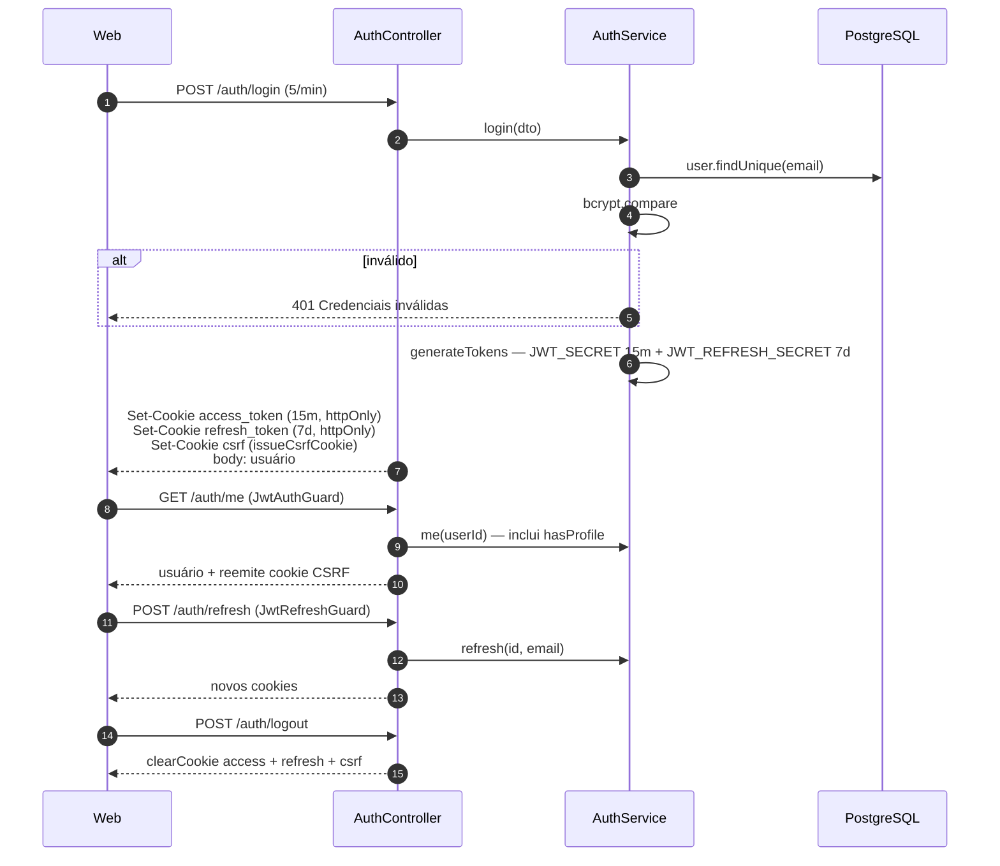
```mermaid
sequenceDiagram
    autonumber
    participant W as Web
    participant A as AuthController
    participant S as AuthService
    participant DB as PostgreSQL

    W->>A: POST /auth/login (5/min)
    A->>S: login(dto)
    S->>DB: user.findUnique(email)
    S->>S: bcrypt.compare
    alt inválido
        S-->>W: 401 Credenciais inválidas
    end
    S->>S: generateTokens — JWT_SECRET 15m + JWT_REFRESH_SECRET 7d
    A-->>W: Set-Cookie access_token (15m, httpOnly)<br/>Set-Cookie refresh_token (7d, httpOnly)<br/>Set-Cookie csrf (issueCsrfCookie)<br/>body: usuário

    W->>A: GET /auth/me (JwtAuthGuard)
    A->>S: me(userId) — inclui hasProfile
    A-->>W: usuário + reemite cookie CSRF

    W->>A: POST /auth/refresh (JwtRefreshGuard)
    A->>S: refresh(id, email)
    A-->>W: novos cookies

    W->>A: POST /auth/logout
    A-->>W: clearCookie access + refresh + csrf
```

Em produção os cookies vão com `sameSite: none` + `secure: true`; em desenvolvimento, `lax` sem `secure`.

### 3.3 Recuperação de senha

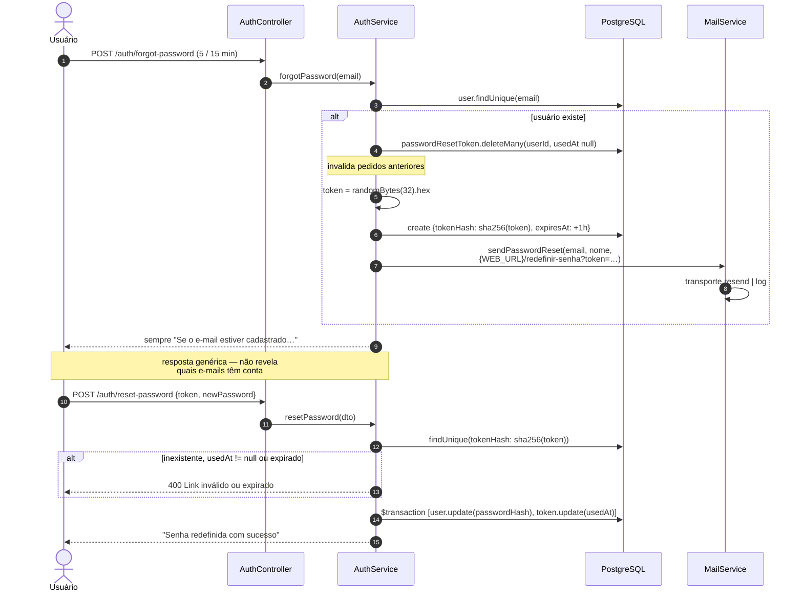
```mermaid
sequenceDiagram
    autonumber
    actor U as Usuário
    participant A as AuthController
    participant S as AuthService
    participant DB as PostgreSQL
    participant M as MailService

    U->>A: POST /auth/forgot-password (5 / 15 min)
    A->>S: forgotPassword(email)
    S->>DB: user.findUnique(email)
    alt usuário existe
        S->>DB: passwordResetToken.deleteMany(userId, usedAt null)
        Note over S: invalida pedidos anteriores
        S->>S: token = randomBytes(32).hex
        S->>DB: create {tokenHash: sha256(token), expiresAt: +1h}
        S->>M: sendPasswordReset(email, nome,<br/>{WEB_URL}/redefinir-senha?token=…)
        M->>M: transporte resend | log
    end
    S-->>U: sempre "Se o e-mail estiver cadastrado…"
    Note over S,U: resposta genérica — não revela<br/>quais e-mails têm conta

    U->>A: POST /auth/reset-password {token, newPassword}
    A->>S: resetPassword(dto)
    S->>DB: findUnique(tokenHash: sha256(token))
    alt inexistente, usedAt != null ou expirado
        S-->>U: 400 Link inválido ou expirado
    end
    S->>DB: $transaction [user.update(passwordHash), token.update(usedAt)]
    S-->>U: "Senha redefinida com sucesso"
```

Só o **hash** do token vive no banco; o valor em claro existe apenas no link enviado por e-mail. Token é de uso único e expira em 1 hora.

### 3.4 Perfil e vínculo do WhatsApp

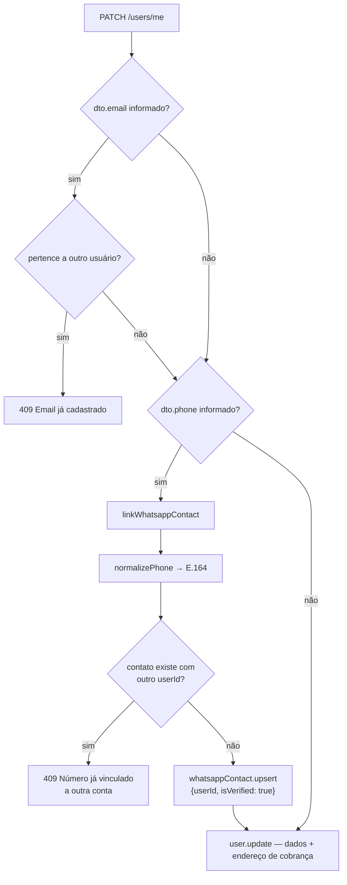
```mermaid
flowchart TD
    A["PATCH /users/me"] --> B{"dto.email informado?"}
    B -->|"sim"| B1{"pertence a outro usuário?"}
    B1 -->|"sim"| BX["409 Email já cadastrado"]
    B1 -->|"não"| C{"dto.phone informado?"}
    B -->|"não"| C
    C -->|"sim"| D["linkWhatsappContact"]
    D --> D1["normalizePhone → E.164"]
    D1 --> D2{"contato existe com<br/>outro userId?"}
    D2 -->|"sim"| DX2["409 Número já vinculado<br/>a outra conta"]
    D2 -->|"não"| D3["whatsappContact.upsert<br/>{userId, isVerified: true}"]
    C -->|"não"| E
    D3 --> E["user.update — dados + endereço de cobrança"]
```

O endereço (`postalCode`, `street`, `addressNumber`, `neighborhood`) atualizado aqui é o que o checkout do Asaas exige — ver [4.1](#41-checkout).

---

## 4. Billing / assinaturas

`apps/api/src/billing/`

### 4.1 Checkout

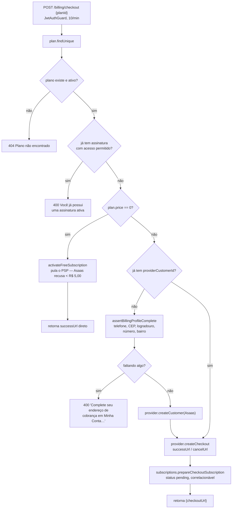
```mermaid
flowchart TD
    A["POST /billing/checkout {planId}<br/>JwtAuthGuard, 10/min"] --> B["plan.findUnique"]
    B --> C{"plano existe e ativo?"}
    C -->|"não"| C1["404 Plano não encontrado"]
    C -->|"sim"| D{"já tem assinatura<br/>com acesso permitido?"}
    D -->|"sim"| D1["400 Você já possui<br/>uma assinatura ativa"]
    D -->|"não"| E{"plan.price == 0?"}

    E -->|"sim"| E1["activateFreeSubscription<br/>pula o PSP — Asaas recusa < R$ 5,00"]
    E1 --> E2["retorna successUrl direto"]

    E -->|"não"| F{"já tem providerCustomerId?"}
    F -->|"não"| G["assertBillingProfileComplete<br/>telefone, CEP, logradouro,<br/>número, bairro"]
    G --> G1{"faltando algo?"}
    G1 -->|"sim"| GX["400 'Complete seu endereço de<br/>cobrança em Minha Conta…'"]
    G1 -->|"não"| H["provider.createCustomer(Asaas)"]
    F -->|"sim"| I
    H --> I["provider.createCheckout<br/>successUrl / cancelUrl"]
    I --> J["subscriptions.prepareCheckoutSubscription<br/>status pending, correlacionável"]
    J --> K["retorna {checkoutUrl}"]
```

> `BILLING_CALLBACK_BASE_URL` existe porque o Asaas **recusa `localhost`** — em dev, aponte para um túnel público (ngrok).

### 4.2 Webhook do PSP

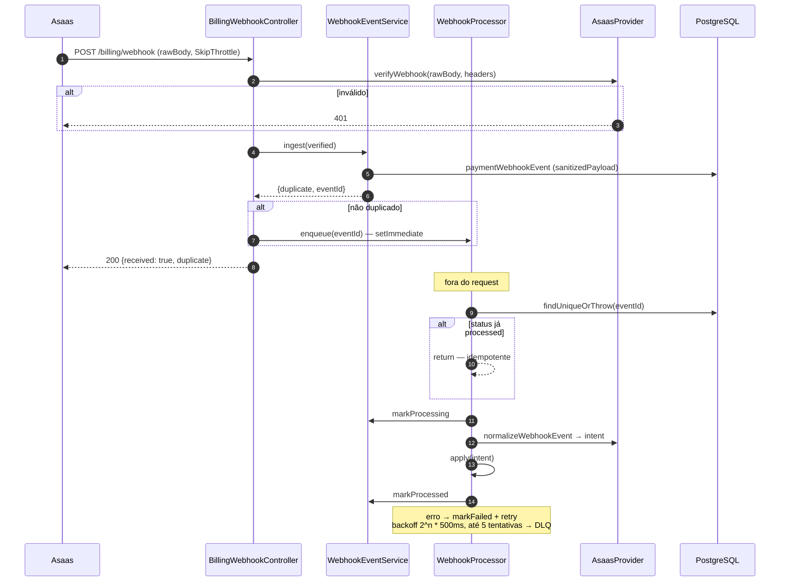
```mermaid
sequenceDiagram
    autonumber
    participant PSP as Asaas
    participant C as BillingWebhookController
    participant EV as WebhookEventService
    participant P as WebhookProcessor
    participant PR as AsaasProvider
    participant DB as PostgreSQL

    PSP->>C: POST /billing/webhook (rawBody, SkipThrottle)
    C->>PR: verifyWebhook(rawBody, headers)
    alt inválido
        PR-->>PSP: 401
    end
    C->>EV: ingest(verified)
    EV->>DB: paymentWebhookEvent (sanitizedPayload)
    EV-->>C: {duplicate, eventId}
    alt não duplicado
        C->>P: enqueue(eventId) — setImmediate
    end
    C-->>PSP: 200 {received: true, duplicate}

    Note over P: fora do request
    P->>DB: findUniqueOrThrow(eventId)
    alt status já processed
        P-->>P: return — idempotente
    end
    P->>EV: markProcessing
    P->>PR: normalizeWebhookEvent → intent
    P->>P: apply(intent)
    P->>EV: markProcessed
    Note over P: erro → markFailed + retry<br/>backoff 2^n * 500ms, até 5 tentativas → DLQ
```

Roteamento por intenção normalizada:

```mermaid
flowchart TD
    A["apply(event)"] --> B{"intent"}
    B -->|"ignore"| B0["nada a fazer"]
    B --> C["locate — providerSubscriptionId,<br/>senão providerCustomerId<br/>com status != canceled/expired"]
    C --> C1{"achou assinatura local?"}
    C1 -->|"não"| C2["warn — evento sem correlação"]
    C1 -->|"sim"| D{"intent"}

    D -->|"payment_succeeded"| E["getSubscription no PSP<br/>(confirma antes de conceder acesso)"]
    E --> E1["transição → active<br/>periodStart/End, graceUntil = null"]
    E1 --> E2["recordPayment status=paid"]

    D -->|"payment_failed"| F{"tinha acesso?<br/>active/trialing/past_due"}
    F -->|"sim"| F1["→ past_due + graceUntil (+3 dias)"]
    F -->|"não"| F2["→ unpaid — 1ª cobrança falhou"]
    F1 & F2 --> F3["recordPayment status=failed"]

    D -->|"payment_refunded"| G["recordPayment status=refunded"]
    D -->|"payment_chargeback"| H["recordPayment chargeback<br/>+ transição → unpaid"]
    D -->|"subscription_canceled"| I{"isCancellationDeferred?<br/>cancelAtPeriodEnd e<br/>currentPeriodEnd no futuro"}
    I -->|"sim"| I1["preserva o acesso —<br/>reconciliação efetiva depois"]
    I -->|"não"| I2["transição → canceled + canceledAt"]
```

Toda transição passa por `tryTransition`: se `canTransition(from, to)` for falsa (replay, evento fora de ordem), a transição é **ignorada com warning** em vez de corromper o estado.

### 4.3 Máquina de estados da assinatura

`subscription-state.service.ts`

```mermaid
stateDiagram-v2
    [*] --> pending: prepareCheckoutSubscription
    pending --> trialing
    pending --> active
    pending --> past_due
    pending --> unpaid
    pending --> canceled
    pending --> expired

    trialing --> trialing
    trialing --> active
    trialing --> past_due
    trialing --> unpaid
    trialing --> canceled
    trialing --> expired

    active --> active: renovação / replay idempotente
    active --> past_due: pagamento falhou
    active --> unpaid
    active --> canceled
    active --> expired

    past_due --> past_due
    past_due --> active: pagamento recuperado
    past_due --> unpaid
    past_due --> canceled
    past_due --> expired

    unpaid --> active
    unpaid --> canceled
    unpaid --> expired

    canceled --> pending: recontratação
    canceled --> active
    expired --> pending
    expired --> active
```

### 4.4 Regra de acesso

`subscription-access.service.ts` — fonte única de verdade, usada pelo guard HTTP **e** pelo canal de IA.

```mermaid
flowchart TD
    A["canUseProduct(userId)"] --> B["subscription.findFirst<br/>order createdAt desc"]
    B --> C{"existe?"}
    C -->|"não"| C1["allowed: false<br/>reason: no_subscription"]
    C -->|"sim"| D{"status"}
    D -->|"active"| D1["allowed: true · active"]
    D -->|"trialing"| E{"trialEndsAt > agora?"}
    E -->|"sim"| E1["allowed: true · trialing"]
    E -->|"não"| E2["allowed: false · trial_expired"]
    D -->|"past_due"| F{"graceUntil > agora?"}
    F -->|"sim"| F1["allowed: true · grace_period"]
    F -->|"não"| F2["allowed: false · grace_expired"]
    D -->|"unpaid / canceled / expired / pending"| G["allowed: false · inactive"]
```

`BILLING_ENFORCEMENT_ENABLED=false` desliga a obrigatoriedade globalmente (soft launch) — tanto no `ActiveSubscriptionGuard` quanto no `InternalService.assertCanUseProduct`.

### 4.5 Reconciliação (cron horário)

```mermaid
flowchart TD
    A["@Cron EVERY_HOUR<br/>billing-reconciliation"] --> B{"execução anterior<br/>ainda rodando?"}
    B -->|"sim"| B1["pula o ciclo"]
    B -->|"não"| C["subscription.findMany<br/>providerSubscriptionId != null<br/>status in active/trialing/past_due/unpaid/pending<br/>order updatedAt asc, take 200"]
    C --> D["para cada: getSubscription no PSP"]
    D --> E["targetFromRemote<br/>active | canceled | expired<br/>demais → null (não corrige)"]
    E --> F{"local.status != target?"}
    F -->|"não"| G{"active e currentPeriodEnd<br/>divergente?"}
    G -->|"sim"| G1["atualiza currentPeriodEnd<br/>+ audit reconciliation:period_update<br/>→ corrected"]
    G -->|"não"| G2["consistent"]
    F -->|"sim"| H{"target=canceled e<br/>isCancellationDeferred?"}
    H -->|"sim"| H1["consistent — acesso preservado<br/>até o fim do período pago"]
    H -->|"não"| I{"canTransition?"}
    I -->|"não"| I1["alerta operacional<br/>→ divergent (correção manual)"]
    I -->|"sim"| I2["transitionTo com<br/>actor=reconciliation + reason<br/>→ corrected"]
```

Segunda linha de defesa: se um webhook se perdeu, o cron corrige o banco de forma auditável (`SubscriptionAudit`).

---

## 5. Fluxos de dados financeiros (CRUD)

Todos os módulos abaixo usam `@UseGuards(JwtAuthGuard, ActiveSubscriptionGuard)` — identidade **e** assinatura ativa.

```mermaid
flowchart LR
    subgraph guards["cadeia de guards"]
        G1["ThrottlerGuard<br/>global 120/min por IP"] --> G2["CsrfGuard<br/>global"] --> G3["JwtAuthGuard<br/>cookie access_token"] --> G4["ActiveSubscriptionGuard"]
    end
    G4 --> C["Controller"] --> V["ValidationPipe<br/>whitelist + transform +<br/>forbidNonWhitelisted"] --> S["Service"] --> P["Prisma"] --> DB[("PostgreSQL")]
```

### 5.1 Lançamentos e saldo

```mermaid
flowchart TD
    subgraph create["POST /transactions"]
        A1["validateOwnership<br/>conta e categoria do usuário"] --> A2["transaction.create source=manual"]
        A2 --> A3{"status === confirmed?"}
        A3 -->|"sim"| A4["recalculateBalance(accountId)"]
    end

    subgraph update["PATCH /transactions/:id"]
        B1["findOne — valida posse"] --> B2["validateOwnership se mudou<br/>accountId/categoryId"]
        B2 --> B3["transaction.update<br/>categoryId '' → null"]
        B3 --> B4["recalculateBalance(conta antiga)"]
        B4 --> B5{"mudou de conta?"}
        B5 -->|"sim"| B6["recalculateBalance(conta nova)"]
    end

    subgraph remove["DELETE /transactions/:id"]
        C1{"hardDelete?"}
        C1 -->|"sim"| C2["transaction.delete"]
        C1 -->|"não"| C3["status = cancelled (soft)"]
        C2 & C3 --> C4["recalculateBalance"]
    end

    subgraph audit["GET /transactions/:id/ai-audit"]
        D1["findOne — valida posse"] --> D2["aiExtractedTransaction.findMany<br/>where transactionId + userId"]
        D2 --> D3{"vazio?"}
        D3 -->|"sim"| D4["404 Nenhuma extração de IA"]
        D3 -->|"não"| D5["histórico de extrações<br/>desc por createdAt"]
    end
```

O saldo da conta **nunca é incrementado**: é sempre recalculado a partir dos lançamentos confirmados (`accountsService.recalculateBalance`), o que torna a operação idempotente e resistente a falhas parciais.

### 5.2 Demais domínios

```mermaid
flowchart LR
    subgraph accounts["accounts"]
        AA["GET /accounts · GET /accounts/:id<br/>POST · PATCH<br/>DELETE → deactivate (isActive false)"]
    end
    subgraph categories["categories"]
        CC["GET — próprias do usuário +<br/>padrão do seu profileType<br/>POST · PATCH · DELETE"]
    end
    subgraph contacts["contacts — clientes/fornecedores"]
        TT["GET com filtro type + search<br/>POST · PATCH · DELETE"]
    end
    subgraph dashboard["dashboard"]
        DD["GET /dashboard/summary<br/>GET /dashboard/daily?month=<br/>GET /dashboard/business/summary"]
    end
```

Categorias respeitam o `profileType` do usuário: a query é `profileType = user.profileType AND (userId = :id OR (isDefault AND userId IS NULL))` — o mesmo critério usado pelo endpoint interno que alimenta o contexto do LLM.

---

## 6. Boas-vindas (API → Agente)

Única chamada no sentido API → Agente.

```mermaid
sequenceDiagram
    autonumber
    participant S as AuthService.register
    participant WN as WelcomeNotificationService
    participant AG as Agente /internal
    participant MSG as messenger
    participant META as WhatsApp

    S->>S: commit da transação de cadastro
    S-)WN: void sendWelcome — não aguarda
    WN->>AG: POST /internal/notifications/welcome<br/>x-internal-api-key, timeout 10s
    AG->>AG: _require_internal_key (hmac.compare_digest)
    AG->>MSG: welcome_service.send_welcome
    MSG->>META: mensagem com exemplos de uso
    AG->>AG: audit_service.log_message outbound
    AG-->>WN: {status: sent}
    Note over WN: falha ou timeout → apenas logger.warn<br/>o cadastro nunca é afetado
```

---

## 7. Mapa de endpoints

### API — `apps/api` (`:3001`)

| Método | Rota | Guards | Observação |
| --- | --- | --- | --- |
| GET | `/` | — | health |
| POST | `/auth/register` | throttle 5/min | cria usuário + perfil + conta + vínculo WhatsApp |
| POST | `/auth/login` | throttle 5/min | emite cookies + CSRF |
| POST | `/auth/forgot-password` | throttle 5 / 15 min | resposta genérica |
| POST | `/auth/reset-password` | throttle 5 / 15 min | token de uso único, 1h |
| POST | `/auth/logout` | — | limpa cookies |
| POST | `/auth/refresh` | `JwtRefreshGuard` | renova o par de tokens |
| GET | `/auth/me` | `JwtAuthGuard` | + reemite cookie CSRF |
| GET | `/users/me/profile` | `JwtAuthGuard` | |
| POST | `/users/me/profile/individual` \| `/business` | `JwtAuthGuard` | |
| PATCH | `/users/me` | `JwtAuthGuard` | vincula WhatsApp se `phone` mudar |
| PATCH | `/users/me/password` | `JwtAuthGuard` | |
| GET | `/billing/plans` | `JwtAuthGuard` | sem exigir assinatura |
| GET | `/billing/subscription` | `JwtAuthGuard` | estado + regra de acesso |
| POST | `/billing/checkout` | `JwtAuthGuard`, 10/min | |
| POST | `/billing/payment-method` | `JwtAuthGuard`, 10/min | atualização de cartão |
| POST | `/billing/cancel` | `JwtAuthGuard` | cancela ao fim do período |
| POST | `/billing/webhook` | assinatura do PSP, `SkipThrottle` | ingest + processamento assíncrono |
| GET/POST/PATCH/DELETE | `/transactions` … | `JwtAuthGuard` + `ActiveSubscriptionGuard` | inclui `/:id/ai-audit` |
| GET/POST/PATCH/DELETE | `/accounts` … | idem | DELETE = desativação |
| GET/POST/PATCH/DELETE | `/categories` … | idem | |
| GET/POST/PATCH/DELETE | `/contacts` … | idem | |
| GET | `/dashboard/summary` · `/daily` · `/business/summary` | idem | |

### API — rotas internas (`InternalApiKeyGuard`, `SkipThrottle`, fora do Swagger)

| Método | Rota | Consumidor |
| --- | --- | --- |
| GET | `/internal/whatsapp/contacts/:phone` | `contact_service` |
| GET | `/internal/whatsapp/contacts/:phone/messages?limit=` | `conversation_history_service` |
| GET | `/internal/users/:userId/categories` | `_build_context`, `transaction_creator` |
| GET | `/internal/users/:userId/accounts` | `_build_context`, `transaction_creator` |
| GET | `/internal/users/:userId/subscription-access` | `subscription_gate` |
| POST | `/internal/transactions/from-ai` | `transaction_creator` |
| POST | `/internal/ai-events` | `audit_service` (message · extraction) |

### Agente — `apps/ai-agent` (`:8010`)

| Método | Rota | Autenticação |
| --- | --- | --- |
| GET | `/health` | — |
| GET | `/metrics` | — (contadores + latências médias) |
| GET | `/webhook/whatsapp` | `hub.verify_token` |
| POST | `/webhook/whatsapp` | HMAC `X-Hub-Signature-256` (ou `X-Webhook-Signature` no modo simulado) |
| POST | `/internal/notifications/welcome` | `x-internal-api-key` |

---

## 8. Guards, segurança e observabilidade

```mermaid
flowchart TD
    subgraph api["API — camadas"]
        A1["helmet — CSP estrito só em produção"]
        A2["CORS — isAllowedWebOrigin, credentials true"]
        A3["cookieParser"]
        A4["ValidationPipe — whitelist, transform,<br/>forbidNonWhitelisted"]
        A5["ThrottlerGuard global 120/min por IP"]
        A6["CsrfGuard global"]
        A7["JwtAuthGuard · JwtRefreshGuard"]
        A8["ActiveSubscriptionGuard"]
        A9["InternalApiKeyGuard — rotas /internal"]
        A1 --> A2 --> A3 --> A4 --> A5 --> A6 --> A7 --> A8
    end

    subgraph agent["Agente — camadas"]
        B1["HMAC-SHA256 do rawBody<br/>obrigatório em produção"]
        B2["hmac.compare_digest — tempo constante"]
        B3["MESSAGE_MAX_CHARS 2000"]
        B4["MEDIA_MAX_BYTES 16 MB"]
        B5["subscription_gate fail-closed"]
        B6["tokens nunca vão para o log"]
    end
```

Métricas expostas em `GET /metrics` (contadores e latências médias em memória):

`webhook_received` · `inbound_buffered` · `inbound_duplicate` · `buffer_flush` · `receive_to_process_ms` · `messages_processed` · `not_linked` · `subscription_blocked` · `llm_success` · `llm_fallback` · `llm_latency_ms` · `vision_success` · `vision_fail` · `transcription_success` · `transcription_fail` · `media_audio` · `media_image` · `media_unsupported` · `confirmation_requested` · `transactions_created` · `transaction_failed` · `processing_error` · `dlq`

Swagger fica **desabilitado em produção**; as rotas internas são `@ApiExcludeController()` mesmo em desenvolvimento.

---

## 9. Configuração relevante

### Agente (`apps/ai-agent/.env`)

| Variável | Padrão | Efeito no fluxo |
| --- | --- | --- |
| `INTERNAL_API_KEY` | — (obrigatória) | Deve ser **idêntica** à da API |
| `MAIN_API_URL` | `http://localhost:3001` | Base das chamadas `/internal` |
| `ENVIRONMENT` | `development` | Em `production`, exige `WHATSAPP_WEBHOOK_SECRET` |
| `WHATSAPP_PROVIDER` | `log` | `log` imprime no console; `cloud-api` envia de verdade |
| `WHATSAPP_VERIFY_TOKEN` / `WHATSAPP_WEBHOOK_SECRET` | vazio | Handshake e HMAC da Meta |
| `WHATSAPP_PHONE_NUMBER_ID` / `WHATSAPP_PROVIDER_TOKEN` | vazio | Envio e download de mídia |
| `LLM_PROVIDER` | `rules` | `openai` ativa o LLM; sem `OPENAI_API_KEY` cai em regras |
| `OPENAI_MODEL` / `OPENAI_VISION_MODEL` / `OPENAI_TRANSCRIPTION_MODEL` | `gpt-4o-mini` / herda / `whisper-1` | |
| `CONFIDENCE_THRESHOLD` | `0.7` | Abaixo disso, pede confirmação |
| `CONVERSATION_TTL_MINUTES` | `30` | Validade do intent pendente |
| `MESSAGE_BUFFER_BACKEND` | `memory` | `redis` habilita durabilidade, retry e DLQ |
| `MESSAGE_BUFFER_DEBOUNCE_SECONDS` | `5` | Janela de agrupamento |
| `MESSAGE_BUFFER_MAX_MESSAGES` | `10` | Flush imediato |
| `MESSAGE_BUFFER_MAX_AGE_SECONDS` | `30` | Teto da janela |
| `MESSAGE_BUFFER_MAX_RETRIES` | `3` | Só no backend Redis |
| `CONVERSATION_CONTEXT_MESSAGE_LIMIT` | `15` | Histórico enviado ao LLM |
| `MESSAGE_MAX_CHARS` | `2000` | Acima disso a mensagem é descartada |
| `MEDIA_MAX_BYTES` | `16 MB` | Limite da Cloud API |
| `WEB_URL` | Vercel | Link de regularização de assinatura |

### API (`apps/api/.env`)

| Variável | Efeito no fluxo |
| --- | --- |
| `INTERNAL_API_KEY` | Valida o agente e autentica as boas-vindas |
| `AI_AGENT_URL` | Destino do `POST /internal/notifications/welcome` |
| `JWT_SECRET` / `JWT_REFRESH_SECRET` | Tokens de 15 min / 7 dias |
| `WEB_URL` | Base do link de redefinição de senha |
| `BILLING_CALLBACK_BASE_URL` | URL pública para callbacks do Asaas (dev: túnel) |
| `BILLING_ENFORCEMENT_ENABLED` | `false` desliga a exigência de assinatura (soft launch) |
| `TZ` | Default `America/Sao_Paulo`, definido antes do bootstrap |

---

## Referências no código

| Fluxo | Arquivos |
| --- | --- |
| Ingestão do webhook | [webhook.py](../apps/ai-agent/src/routers/webhook.py), [whatsapp_inbound.py](../apps/ai-agent/src/services/whatsapp_inbound.py) |
| Buffer / debounce | [message_buffer.py](../apps/ai-agent/src/services/message_buffer.py), [redis_buffer.py](../apps/ai-agent/src/services/redis_buffer.py) |
| Processamento | [message_processor.py](../apps/ai-agent/src/services/message_processor.py), [confirmation_rules.py](../apps/ai-agent/src/services/confirmation_rules.py) |
| Classificação | [intent_classifier.py](../apps/ai-agent/src/services/intent_classifier.py), [llm/factory.py](../apps/ai-agent/src/services/llm/factory.py) |
| Mídia | [media_processor.py](../apps/ai-agent/src/services/media_processor.py), [whatsapp_media.py](../apps/ai-agent/src/services/whatsapp_media.py), [transcription.py](../apps/ai-agent/src/services/transcription.py) |
| Criação do lançamento | [transaction_creator.py](../apps/ai-agent/src/services/transaction_creator.py), [internal.service.ts](../apps/api/src/internal/internal.service.ts) |
| Gate de assinatura | [subscription_gate.py](../apps/ai-agent/src/services/subscription_gate.py), [subscription-access.service.ts](../apps/api/src/billing/services/subscription-access.service.ts) |
| Auth | [auth.service.ts](../apps/api/src/auth/auth.service.ts), [auth.controller.ts](../apps/api/src/auth/auth.controller.ts) |
| Billing | [billing.service.ts](../apps/api/src/billing/billing.service.ts), [webhook.processor.ts](../apps/api/src/billing/webhook/webhook.processor.ts), [subscription-state.service.ts](../apps/api/src/billing/services/subscription-state.service.ts), [reconciliation.service.ts](../apps/api/src/billing/reconciliation.service.ts) |
| Boas-vindas | [welcome-notification.service.ts](../apps/api/src/notifications/welcome-notification.service.ts), [welcome_service.py](../apps/ai-agent/src/services/welcome_service.py) |
| Modelos | [schema.prisma](../apps/api/prisma/schema.prisma) |

### Documentos relacionados

- [Requisitos técnicos](technical-requirements.md)
- [Processamento assíncrono WhatsApp/IA](whatsapp-ai-async-processing-requirements.md)
- [Rollout de billing](billing-rollout.md)
